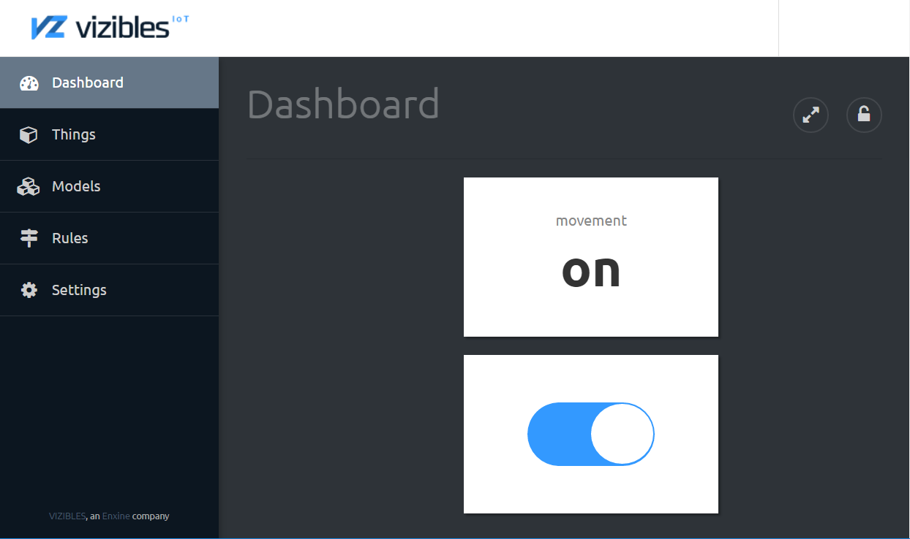
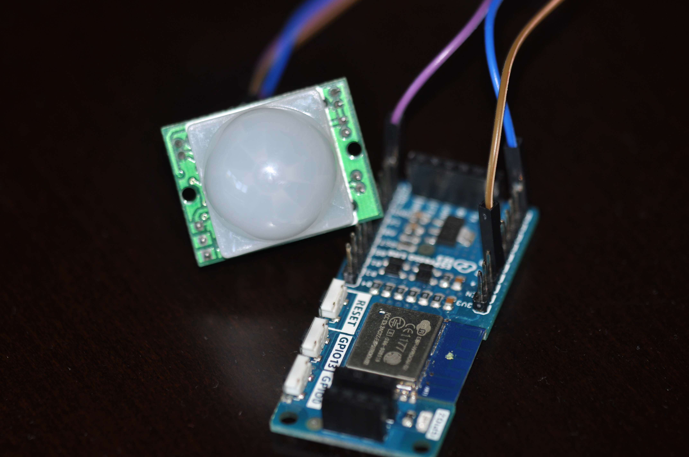

# Detector de movimiento para Vizibles (PIR)

Leer en otros idiomas: [English](https://github.com/Enxine/ViziblesArduino/blob/master/examples/MovementDetector/README.md), [Español](https://github.com/Enxine/ViziblesArduino/blob/master/examples/MovementDetector/README.es.md)

Con este sketch puedes construir un detector de movimiento conectado a Internet para usarlo en tus proyectos de domótica. 
El resultado es un sensor de movimiento PIR (Passive Infrared) completamente funcional, incluso con un LED de estado que se puede activar o desactivar remotamente, por ejemplo para los periodos nocturnos.  

## Materiales

 * [Placa Espresso Lite v2.0](http://www.espressolite.com/)
 * [Placa PIR](https://www.amazon.es/gp/product/B00SO1THJ2)
 * Cables 
 
 
 